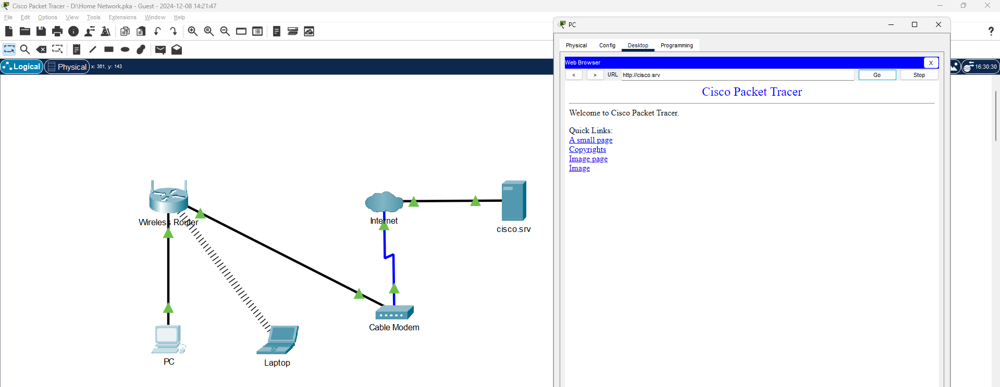
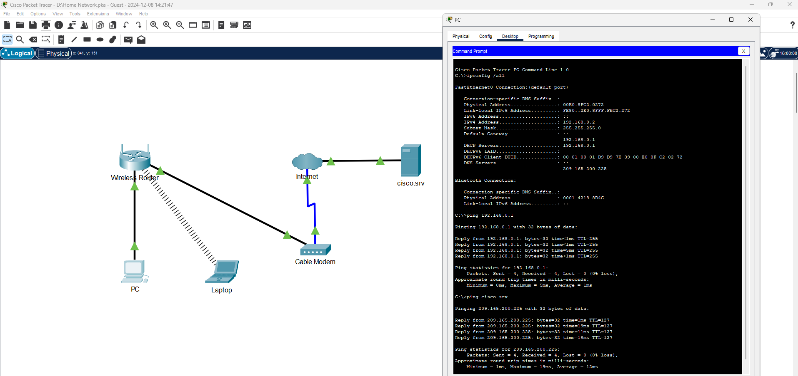

# Home Network Simulation in Cisco Packet Tracer

## Objective:
Designed and implemented a simple home network using Cisco Packet Tracer to understand foundational networking concepts and simulate real-world configurations of home devices.

## Skills Learned:
- Configuration of end devices (PC, Laptop) and network hardware (cable modem, wireless router).
- Use of IP addressing, subnetting, and Dynamic Host Configuration Protocol (DHCP).
- Verifying network connectivity and troubleshooting common issues.
- Understanding and simulating wireless network connections.

## Tools Used:
- **Cisco Packet Tracer** for network simulation.

## Steps:

### 1. Build the Network:
- Added a PC, laptop, cable modem, and wireless router to the logical workspace.
- Connected devices using appropriate cables (copper straight-through and coaxial cables).

### 2. Configure End Devices:
- Enabled DHCP on the PC and laptop to assign IP addresses automatically.
- Replaced the laptop’s wired NIC with a wireless module to connect to the wireless network.

### 3. Verify Connectivity:
- Used the `ipconfig` and `ping` commands on the PC and laptop to verify network connectivity.
- Ensured both devices could access the simulated server (`cisco.srv`).

## Screenshot Reference:

1. **Network Diagram showing the connections between the cable modem, wireless router, PC, and laptop.**
   

2. **Command prompt output verifying successful pings to `cisco.srv`.**
   
